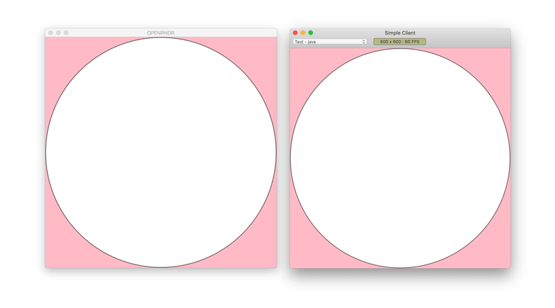

# orx-syphon

Send frames to- and from OPENRNDR to other applications in real time using _Syphon_ for Mac.



### Syphon Server
#### Sharing the whole view
```kotlin
import org.openrndr.application
import org.openrndr.color.ColorRGBa
import kotlin.math.sin


fun main() {
    System.setProperty("org.openrndr.gl3.gl_type", "gl")
    application {
        configure {
            width = 1000
            height = 1000
        }

        program {
            extend(SyphonServer())

            extend {
                drawer.background(ColorRGBa.RED)
                drawer.circle(width / 2.0, height / 2.0, sin(seconds) * width / 2.0)
            }
        }
    }
}
```

#### Sharing a different render target
```kotlin
import org.openrndr.application
import org.openrndr.color.ColorRGBa
import org.openrndr.draw.isolatedWithTarget
import org.openrndr.draw.renderTarget
import kotlin.math.*


fun main() {
    System.setProperty("org.openrndr.gl3.gl_type", "gl")
    application {
        configure {
            width = 1000
            height = 1000
        }

        program {
            val rt = renderTarget(100, 100) {
                colorBuffer()
            }

            // You can give the server a different name
            extend(SyphonServer("Test", rt))

            extend {
                /**
                 * This is what will be sent to Syphon, and drawn in a small corner of the screen
                 */
                drawer.isolatedWithTarget(rt) {
                    drawer.background(ColorRGBa(sin(seconds), cos(seconds / 2.0), 0.5, 1.0))
                }

                drawer.background(ColorRGBa.GRAY)
                drawer.circle(width / 2.0, height / 2.0, sin(seconds) * width / 2.0)
                drawer.image(rt.colorBuffer(0))
            }
        }
    }
}
```

### Syphon Client
```kotlin
fun main() = application {
    configure {
        width = 1000
        height = 800
    }

    program {
        val syphonClient = SyphonClient()

        extend(syphonClient)
        extend {
            drawer.background(ColorRGBa.BLACK)
            drawer.image(syphonClient.buffer)
        }
    }
}
```
